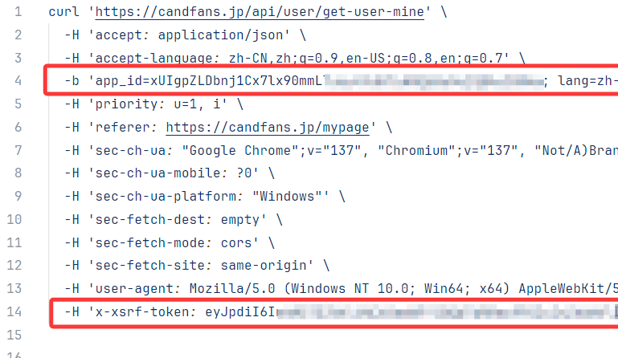
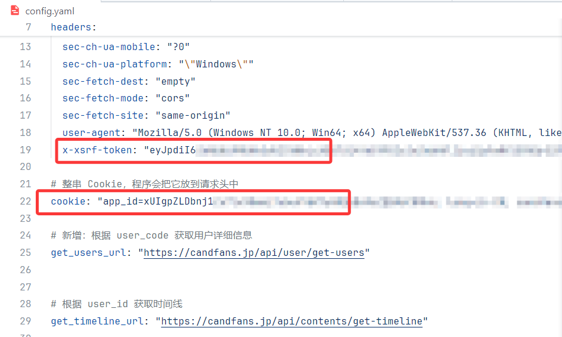

# CandFans Downloader

CandFans Downloader is a Python application for archiving content from your [candfans.jp](https://candfans.jp/) subscriptions. It provides a desktop GUI that logs into your account, fetches posts from subscribed creators, and saves video files locally.

## Features
- Embedded login window captures cookies and XSRF token automatically, storing them in `config.yaml`.
- Configuration dialog to edit API endpoints, authentication headers, and download directory.
- Load account list from your subscriptions and fetch timeline posts.
- Filter posts by keyword, month, and media type (`mp4` or `m3u8`).
- Batch download with progress bar, pause/resume, and cancel support.
- Merges `m3u8` streams into MP4 files using `ffmpeg`.

## Requirements
- Python 3.8+
- Dependencies from `requirements.txt`
- [FFmpeg](https://ffmpeg.org/) available in your `PATH`.

## Installation

```bash
git clone https://github.com/<repo>/candfans-downloader.git
cd candfans-downloader
python -m venv venv   # optional
source venv/bin/activate  # or venv\\Scripts\\activate on Windows
pip install -r requirements.txt
```

Ensure `ffmpeg` is installed and accessible.

## Configuration

Running the program for the first time creates a `config.yaml`.
Open **Config** in the GUI to fill in:

| Field | Description |
| --- | --- |
| `base_url` | API endpoint for your subscription list |
| `get_users_url` | API endpoint for user info by code |
| `get_timeline_url` | API endpoint for timeline posts |
| `headers.x-xsrf-token` | XSRF token from CandFans |
| `cookie` | login cookies |
| `download_dir` | folder for saved files |

### Automatic login

Click **Login** in the GUI. A browser window appears; sign in and the application captures cookies and the XSRF token, saving them to `config.yaml` automatically.

### Manual token retrieval

If automatic login fails, obtain the values manually:

1. Log in to CandFans using Chrome.
2. Open Developer Tools (`F12`) → **Network** and refresh the page.
3. Locate the `get-user-mine` request, right-click, and choose **Copy as cURL**.
4. Extract `x-xsrf-token` and the cookie string from the command and paste them into `config.yaml`.




## Running

Start the GUI:

```bash
python main.py
```

Typical workflow:

1. **Login** – capture authentication cookies.
2. **Load account list** – retrieves all subscribed creators.
3. **Fetch posts** – select accounts and choose number of pages or fetch all; optional filters for keyword, month, and type.
4. **Download** – select desired posts and click *Start Download*. Use *Pause* or *Cancel* as needed. Downloads are saved under `download_dir`.

## Programmatic use

The core download logic lives in `downloader.download_and_merge()` which accepts a media URL and merges `m3u8` segments with `ffmpeg`. You may import and use this function in your own scripts.

---

*CandFans Downloader is intended for personal archival of legally obtained content.*
