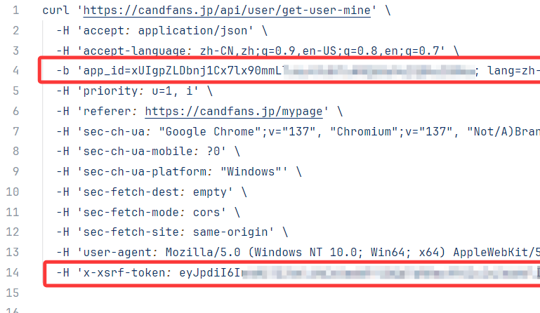
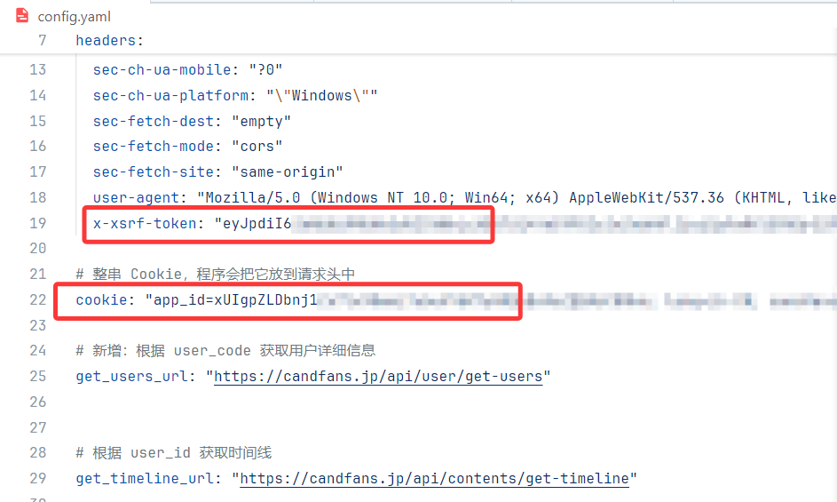

English | [中文](docs/README_zh.md)

# CandFans Downloader

CandFans Downloader is a Python application for archiving content from your [candfans.jp](https://candfans.jp/) subscriptions. It provides a desktop GUI to log into your account, fetch posts from subscribed creators, and save video files locally.

## Usage

### Getting Started

1. Install `ffmpeg` and ensure it is available in your system `PATH`.
2. Open the latest release page and download the attachment for your OS.
   - Releases: https://github.com/miraged3/candfans-downloader/releases
3. If you are on Windows, run the downloaded `.exe` directly.
4. If you are on macOS/Linux, extract the downloaded file and run the executable.
5. Click the login button and sign in to your CandFans account.
6. After logging in, choose between two tabs:

#### Release attachment names

- Windows x64: `candfans-downloader-vX.Y.Z-Windows-x64.exe`
- Windows arm64: `candfans-downloader-vX.Y.Z-Windows-arm64.exe`
- macOS x64: `candfans-downloader-vX.Y.Z-macOS-x64.tar.gz`
- macOS arm64: `candfans-downloader-vX.Y.Z-macOS-arm64.tar.gz`
- Linux x64: `candfans-downloader-vX.Y.Z-Linux-x64.tar.gz`
- Linux arm64: `candfans-downloader-vX.Y.Z-Linux-arm64.tar.gz`

#### Subscription Timeline Tab

- Click `Fetch subs`; the left panel shows all subscribed accounts.
- Click `Fetch posts` to retrieve all downloadable posts. Use the filters at the top of the window as needed.
- Select posts and click `Start download`.

#### Purchased Contents Tab

- Click `Fetch purchased` to load all your purchased contents.
- Use filters to narrow down by keyword or purchase month.
- Select contents and click `Start download`.

### Manual token retrieval

If automatic login fails, you can obtain the values manually:

1. Log in to CandFans using Chrome.
2. Open Developer Tools (`F12`) → **Network** and refresh the page.
3. Find the `get-user-mine` request, right-click and choose **Copy as cURL**.
4. Extract `x-xsrf-token` and the cookie string from the command and paste them into the configuration, then click fetch posts.

## Features

- **Subscription Timeline Downloads**: Download content from your subscribed creators
- **Purchased Content Downloads**: Download individually purchased content with filtering by keyword and month
- **GUI Interface**: User-friendly desktop application with tabbed interface
- **Filtering Options**: Filter content by keyword, month, and file type
- **Progress Tracking**: Real-time download progress with pause/resume functionality
- **Automatic Organization**: Content is organized by creator and post ID

## Advanced Configuration

`ffmpeg` must be installed and available in your system `PATH`.

Running the program for the first time creates `config.yaml`. You can also open **Config** in the GUI to fill in:

| Field | Description |
|-------|-------------|
| `Base Url`      | API endpoint for the subscription list |
| `Get Users Url` | API endpoint to get user info by code |
| `Timeline Url`  | API endpoint for timeline posts |
| `Token`         | XSRF token from CandFans |
| `Cookie`        | Login cookie |
| `Download Path` | Folder where files are saved |

---

*CandFans Downloader is intended for personal archiving of legally obtained content.*
