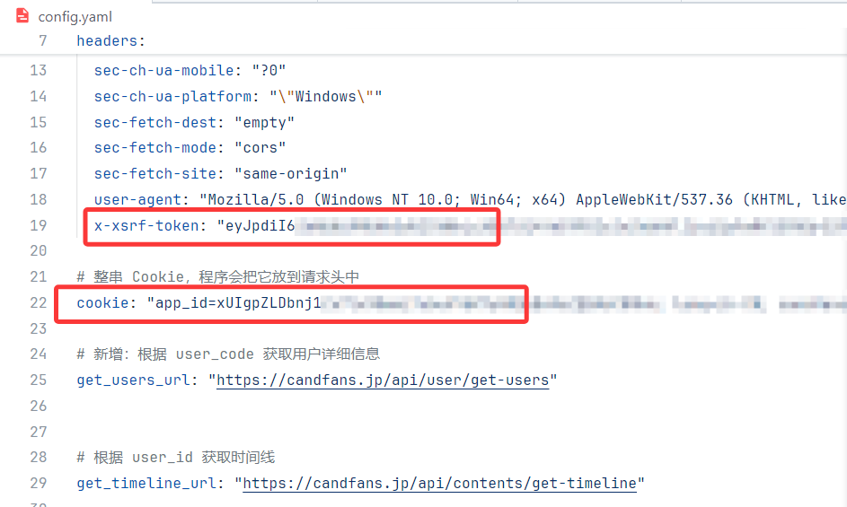

[English](../README.md) | 中文

# CandFans 下载器

CandFans Downloader 是一个用于从你的 [candfans.jp](https://candfans.jp/) 订阅中归档内容的 Python
应用程序。它提供桌面图形界面，登录你的账户，获取已订阅创作者的帖子，并将视频文件保存到本地。

## 运行环境

- Python 3.8+
- `requirements.txt` 中的依赖
- `PATH` 中可用的 [FFmpeg](https://ffmpeg.org/)

## 安装

```bash
git clone https://github.com/miraged3/candfans-downloader
cd candfans-downloader
pip install -r requirements.txt
```

使用前请确保已安装 `ffmpeg` 并配置到 `PATH`

## 配置

程序首次运行会生成 `config.yaml`。也在 GUI 中打开 **Config** 来填写：

| 字段              | 说明                     |
|-----------------|------------------------|
| `Base Url`      | 订阅列表的 API 端点           |
| `Get Users Url` | 根据 code 获取用户信息的 API 端点 |
| `Timeline Url`  | 时间线帖子的 API 端点          |
| `Token`         | 来自 CandFans 的 XSRF 令牌  |
| `Cookie`        | 登录 Cookie              |
| `Download Path` | 保存文件的文件夹               |

## 使用方法

### GUI 模式

1. 启动程序，在终端中执行：`PYTHONPATH=src python -m main`
2. 点击登录按钮，登录CandFans账号
3. 登录成功之后，可以选择两个标签页：

#### 订阅时间线标签页

- 点击`Fetch subs`按钮，左边的窗口会显示所有有订阅的账号
- 点击`Fetch posts`按钮，会拉取该账号所有可下载的帖子，可在窗口上方按条件筛选
- 选择帖子并点击`Start download`按钮

#### 购买内容标签页

- 点击`Fetch purchased`按钮来加载所有购买的内容
- 使用过滤器按关键词或购买月份进行筛选
- 选择内容并点击`Start download`按钮

### 手动获取令牌

如果自动登录失败，可手动获取这些值：

1. 使用 Chrome 登录 CandFans
2. 打开开发者工具（`F12`）→ **Network** 并刷新页面
3. 找到 `get-user-mine` 请求，右键选择 **Copy as cURL**
4. 从命令中找出 `x-xsrf-token` 和 Cookie 字符串并将相应的值粘贴到配置中，再点击拉取帖子




## 功能特性

- **订阅时间线下载**：下载已订阅创作者的内容
- **购买内容下载**：下载单独购买的内容，支持按关键词和月份过滤
- **图形界面**：用户友好的桌面应用程序，采用标签页界面
- **过滤选项**：按关键词、月份和文件类型过滤内容
- **进度跟踪**：实时下载进度，支持暂停/恢复功能
- **自动组织**：内容按创作者和帖子ID自动组织

## 未来计划

- 打包成独立程序
- 语言切换
- 更多过滤选项

---

*CandFans Downloader 仅用于对合法获取的内容进行个人归档。*
